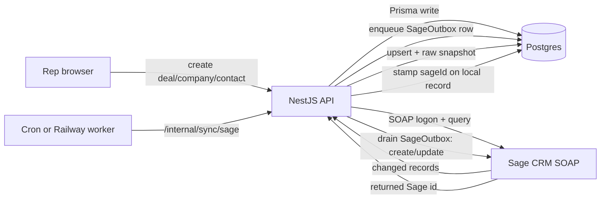

# Sage CRM SOAP Sync — Plan

This is a planning document. No code is written yet. It fills in the "Phase 7 — Sage CRM interface layer" placeholder already reserved in [docs/plans/m365-expansion.md](docs/plans/m365-expansion.md).

## Decisions locked in

- **Sage is the source of truth.** Nightly pull overwrites the local copy; local edits are pushed to Sage and Sage's version wins on the next pull.
- **Full local replica.** The three core entities map onto existing tables (`Company`, `Contact`, `Deal`), and every synced Sage record also keeps a raw JSON snapshot so no field or relationship is lost even before it is mapped.
- **Scope:** Sage Companies, People (contacts), Opportunities (deals). Owners mapped by matching the Sage user's email to this app's `User.email`; no match leaves the record unassigned.
- **Direction:** inbound pull (authoritative) + outbound push of creates. Both are mechanical, so they live in the API (`apps/api`), consistent with the "intelligence never lives in the API" rule and the Google precedent.
- **Hosting** (Vercel cron vs a long-running Railway worker hitting the same route) is a deploy detail decided at build time; SOAP calls can be slow, so a Railway worker is the safer default.

## How it fits the codebase

The write path for every entity is already: thin tRPC router -> service -> Prisma write, and the service is exactly where the existing agent-queue hook lives. Sage push hooks go in the same place.

- Companies: `create()` in [apps/api/src/companies/companies.service.ts](apps/api/src/companies/companies.service.ts) (already calls `this.agent.companyCreated(...)`)
- Contacts: `create()` in [apps/api/src/contacts/contacts.service.ts](apps/api/src/contacts/contacts.service.ts) (already calls `this.agent.contactCreated(...)`; can auto-create a company)
- Deals: `create()` in [apps/api/src/deals/deals.service.ts](apps/api/src/deals/deals.service.ts) (the only one with no queue hook today)

The inbound pull copies the Google module shape: a provider module, a cron route guarded by `CRON_SECRET`, cursor state in Postgres, mechanical upserts. See [apps/api/src/google/](apps/api/src/google/) and its cron entry in [apps/api/scripts/build-func.mjs](apps/api/scripts/build-func.mjs).

## Schema changes (packages/db)

In [packages/db/prisma/schema.prisma](packages/db/prisma/schema.prisma):

- `RecordSource` enum: add `SAGE`.
- `Company`: add `sageCompanyId String? @unique` (follows the existing `{provider}{Entity}Id` convention).
- `Contact`: add `sageContactId String? @unique` (Sage "Person").
- `Deal`: add `sageOpportunityId String? @unique` (Sage "Opportunity").
- New `SageSyncState` (mirrors `MailboxSync`): one row per entity type (`company | person | opportunity`), holding `status`, `cursor` (last-updated marker), `lastSyncedAt`, `retryAfter`.
- New `SageRecordSnapshot`: `entity`, `sageId`, `payload Json`, `updatedAt`, `@@unique([entity, sageId])` — the raw replica that guarantees no field is lost.
- New `SageOutbox` (durable outbound queue): `entity`, `localId`, `operation` (CREATE/UPDATE), `status` (PENDING/RUNNING/DONE/FAILED), `attempts`, `error`, `createdAt`, `finishedAt`.

Then `bun run db:migrate` naming the migration `add_sage_sync`.

## New module: apps/api/src/sage/

Mirror the Google module file-for-file:

- `sage.constants.ts` — entity names, source values, field mappings.
- `sage-soap.client.ts` — wraps a Node SOAP client (`soap` npm package) against the Sage WSDL; handles logon/session, and `query`/`create`/`update` per entity. Reads config via a capability helper so a missing config disables the feature instead of throwing (pattern: `googleCredentials()` in [packages/auth/src/env.ts](packages/auth/src/env.ts)).
- `sage-pull.service.ts` — per entity, query records changed since the cursor; upsert into `Company`/`Contact`/`Deal` by `sage*Id`; write the raw `SageRecordSnapshot`; set `source = SAGE`. Writes Prisma directly (not through `*.service.create`) so the pull never re-triggers an outbound push (loop prevention).
- `sage-push.service.ts` — drain `SageOutbox`: build the SOAP request from the local record, create/update in Sage, store the returned Sage id on the local row, mark DONE/FAILED.
- `sage-match.service.ts` — Sage id <-> local id mapping, owner email -> `User`, and linking People/Opportunities to their Company.
- `sage-sync.service.ts` — orchestrator `runDue()` (pull then drain outbox within a time budget), mirroring `GoogleSyncService.runDue()`.
- Add `GET|POST /internal/sync/sage` to [apps/api/src/google/sync.controller.ts](apps/api/src/google/sync.controller.ts) (same `CRON_SECRET` bearer guard).
- `sage.router.ts` — tRPC `status` / `syncNow`; then `bun run --filter=api trpc:generate` and commit `src/generated/server.ts`.
- `sage.module.ts` — wire and register in `app.module.ts`.
- Cron: add a `/internal/sync/sage` entry in [apps/api/scripts/build-func.mjs](apps/api/scripts/build-func.mjs) (or run it from a Railway worker calling the route).

## Outbound hooks (where creates push to Sage)

After each successful create, enqueue a `SageOutbox` CREATE row (mechanical, guarded by the Sage capability):

- `CompaniesService.create` in [apps/api/src/companies/companies.service.ts](apps/api/src/companies/companies.service.ts)
- `ContactsService.create` in [apps/api/src/contacts/contacts.service.ts](apps/api/src/contacts/contacts.service.ts) (also enqueue the company when it auto-creates one via `CompanyDirectoryService.companyForEmail`)
- `DealsService.create` in [apps/api/src/deals/deals.service.ts](apps/api/src/deals/deals.service.ts)

Later: the matching `update()` methods enqueue UPDATE rows. Not in the first cut.

## Env / config

One `.env` at the root. Add `SAGE_SOAP_URL`, `SAGE_SOAP_USER`, `SAGE_SOAP_PASSWORD` (all-three-or-none capability). Document them in `.env.example` and declare them in [apps/api/src/config/env.validation.ts](apps/api/src/config/env.validation.ts) as optional strings.

## Open items to resolve at build time

- Exact Sage WSDL entity/field names and the "changed since" query supported by your Sage version (2022+). Confirm against the live WSDL before mapping.
- Conflict window: a local edit pushed to Sage vs the next authoritative pull — the pull should skip clobbering rows with a still-pending `SageOutbox` entry.
- Whether newly pulled companies should also enqueue an agent enrichment task (`AgentTriggerService.companyCreated`) or stay quiet.
- Final hosting choice (Vercel cron vs Railway worker).

## Verification (per the repo rules)

`bun run check-types`, `bun run lint`, `bun run test`, and a manual smoke test. Regenerate and commit `apps/api/src/generated/server.ts` after any router change. Update `HANDOFF.md` when work starts/stops.