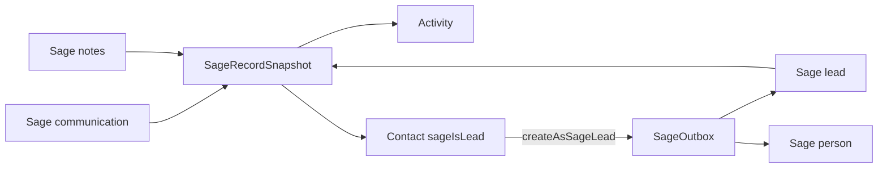

# Sage extra-modules plan doc

## Deliverable

Create a living plan at [`docs/plans/sage-extra-modules.md`](docs/plans/sage-extra-modules.md), same evolution pattern as [`docs/plans/pipeline-pulse.md`](docs/plans/pipeline-pulse.md) / [`docs/plans/sage-crm-sync.md`](docs/plans/sage-crm-sync.md): Status table, Locked decisions, phased build, backlog, key files, smoke. Cross-link from [`HANDOFF.md`](HANDOFF.md) Current state and from [`docs/plans/sage-crm-sync.md`](docs/plans/sage-crm-sync.md) §3c / §4 item 5.

This step writes the **plan doc only** (no schema/API/UI code yet).

## Locked product decisions (bake into the doc)

1. **Scope**: communications + notes + leads for build; quotes / orders / Mas* / cases / documents / relationships / consent as **backlog only**.
2. **Guiding principle** (same as parent Sage plan): fit Sage into existing CRM models; fewest new columns; raw fidelity in `SageRecordSnapshot`; intelligence stays out of Nest.
3. **Communications → `Activity`**: map Sage `communication` into the existing timeline. Add `Activity.sageCrmCommunicationId String? @unique` (+ `sageUpdatedAt` / echo-guard fields mirroring Company if push comes later). Map Sage `type`/`action` → `ActivityType` (`EMAIL` / `CALL` / `TASK` / `MEETING` / fallback `NOTE`). Resolve `companyId` / `contactId` via Sage company/person FKs on the communication (exact column names confirmed in phase 0 probe). Skip rows that cannot resolve to a known local company (or park under company when only company id exists).
4. **Notes → `Activity` `NOTE`**: entity name is `notes`. Add `Activity.sageCrmNoteId String? @unique`. Use `foreignid` / `foreigntableid` / `personid` to attach to company or contact. No separate Note table.
5. **Leads → `Contact` (no Lead model)**: Sage `lead` upserts into `Contact`. Add `Contact.sageCrmLeadId String? @unique` and `Contact.sageIsLead Boolean @default(false)` (true while the Sage-side record is still a lead). Prefer match order: `sageCrmLeadId` → existing `sageCrmContactId` if lead already converted → email+company soft link → create. When `primarycompanyid` exists, link; else create/find `Company` from denormalized lead company fields (name/city) without inventing domains.
6. **Create-as-lead toggle (push)**: on human “New contact”, a boolean (default off) **Create as Sage lead**. That flag sets `sageIsLead=true` and drives `SageOutbox` to SOAP `add` on entity `lead` instead of `person`. Updates stay on the same Sage entity the row is linked to (`sageCrmLeadId` vs `sageCrmContactId`). Screening Room approve stays “create person/contact” (no lead) unless we later add the same toggle there.
7. **Pull only first** for communications/notes; lead create-as-lead is the first push extension beyond the triad. Bidirectional edit of Sage notes/comms is out of scope.
8. **UI**: Sage-sourced timeline rows show like email/calendar sync (`meta.source: "sage"`); contacts with `sageIsLead` get a small Lead badge on list/sheet (no new Leads page).
9. **Dedup with Outlook/Gmail**: do not merge Sage communications into `emailThreadId` projections in v1 — separate Activity rows; later dedup is backlog.

## Plan doc structure (what we will write)

```markdown
# Sage extra modules — communications, notes, leads

## Status (all TODO initially)
## Locked decisions (2026-08-03)   # items 1–9 above
## Probe evidence                  # link scripts + recency facts
## Architecture
## Phase 0 — field catalog (SOAP getmetadata / sample queries)
## Phase 1 — schema
## Phase 2 — communications pull
## Phase 3 — notes pull
## Phase 4 — leads → Contact pull
## Phase 5 — create-as-lead UI + push
## Backlog (opaque / empty modules)
## Key files
## Local smoke
## Out of scope
## HANDOFF linkage
```

### Architecture (to document with a small diagram)



### Phase details the doc will spell out

| Phase | Work |
| --- | --- |
| **0** | Re-use / extend [`apps/api/scripts/sage-probe-entities.ts`](apps/api/scripts/sage-probe-entities.ts): dump full field lists for `communication`, `notes`, `lead`; confirm company/person FK column names; sample 5 recent rows each. Record mapping catalog in the plan (like sage-crm-sync §3). |
| **1** | Prisma: Activity sage ids; Contact `sageCrmLeadId` + `sageIsLead`; extend `SageSyncState` / snapshot entity strings to `communication` \| `notes` \| `lead`. Migration. |
| **2** | `SagePullService` incremental+backfill for `communication` → Activity; wire into nightly `/internal/sync/sage` after triad. |
| **3** | Same for `notes` → Activity NOTE. |
| **4** | Lead pull → Contact/Company upsert; list/sheet Lead badge. |
| **5** | Contact create sheet toggle; push path in [`sage-push.service.ts`](apps/api/src/sage/sage-push.service.ts) branches lead vs person. |
| **Backlog** | quotes/orders/Mas* (query fails), cases (empty), library/documents (not enabled), relationships/consent/selfservice (no entity). |

### Cross-links to update when writing the doc

- [`HANDOFF.md`](HANDOFF.md): Current state bullet pointing at the new plan; work-log entry “plan authored”.
- [`docs/plans/sage-crm-sync.md`](docs/plans/sage-crm-sync.md) §3c / §4 item 5: replace soft “confirm with team” with pointer to `sage-extra-modules.md` and the locked lead→Contact decision.

## Defaults already chosen (no further product forks)

- One plan file for all three modules + backlog (not three docs).
- No new `Lead` table.
- No standalone sync of address/phone/email (already nested under company).
- Communications/notes are pull-first; only lead create gets new push behavior in phase 5.
