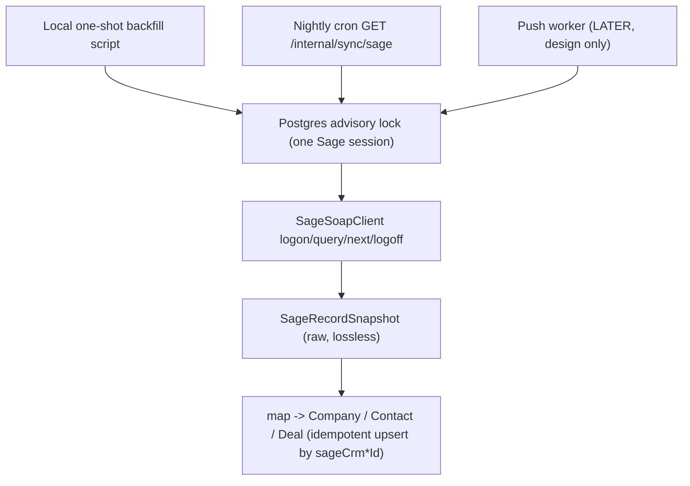

# Sage full sync — safe backfill, user prep, and ongoing-sync design

Canonical references: [docs/plans/sage-crm-sync.md](docs/plans/sage-crm-sync.md) §6, and the existing Sage module in [apps/api/src/sage/](apps/api/src/sage/). This plan resolves the eight open questions in [HANDOFF.md](HANDOFF.md) with the two human decisions made (local one-shot backfill; push design-only) plus recommended defaults for the rest.

## Guardrails (do not break)
- One Sage Web Services session globally. A second `logon` kicks the first. Serialize everything.
- Never retry-spam `logon` (can lock the service account). The client already returns `auth-failed` without retry — keep it.
- Fit Sage into existing models; snapshot is the lossless backstop; keep the `DealStage` enum.
- Intelligence never in the API. This is mechanical: SOAP -> map -> Prisma.

## Architecture

## Part A — Pre-create the 11 Sage users (do first)
- Extend [apps/api/src/sage/sage.mappings.ts](apps/api/src/sage/sage.mappings.ts): add a `SAGE_USERS` list of `{ sageId, firstName, lastName, email }` from the supplied CSV; derive `SAGE_USER_EMAILS` / `emailForSageUser` from it (no behaviour change).
- Add `ensureSageUsers(db)` (in a small `sage-users.ts` or on the pull service) that upserts each by `email`, `emailVerified: true`, stable `id: "sage-user-<sageId>"`, mirroring `seedOwners()` in [packages/db/prisma/seed.ts](packages/db/prisma/seed.ts). Idempotent.
- Expose a one-shot: `bun run scripts/ensure-sage-users.ts` (template: [apps/api/scripts/backfill-icon-tone.ts](apps/api/scripts/backfill-icon-tone.ts)). The backfill also calls it before importing deals.
- Note: `sales@antenna.com` (id 0) is not a `mobilemark.com` address, so it cannot sign in, but can still own deals. Fine.

## Part B — Schema (additive migration)
Extend [packages/db/prisma/schema.prisma](packages/db/prisma/schema.prisma):
- `SageSyncState`: add `phase String @default("backfill")`, `backfillId String?` (last companyid checkpoint), `highWaterUpdatedAt DateTime?` (incremental cursor; keep `cursor` for back-compat), optional `processed Int?` and `backfillDoneAt DateTime?`.
- Soft-deactivate (§6.7): add `sageDeactivatedAt DateTime?` to `Company` and `Contact` (Deal optional). Never hard-delete Sage rows.
- Push design markers (columns now, used later): `sagePushedAt DateTime?` and `sageUpdatedAt DateTime?` on `Company`/`Contact`/`Deal` — the echo guard for ongoing sync.

## Part C — Safety layer (shared by all Sage jobs)
- **Cross-process lock**: `withSageSession()` helper wrapping `pg_advisory_lock` (try/finally `logoff` + unlock). Replaces the in-process `private running` flag in [apps/api/src/sage/sage-pull.service.ts](apps/api/src/sage/sage-pull.service.ts) as the real guard.
- **Snapshot-first**: page -> write all `SageRecordSnapshot` rows -> map from snapshots. Decouples network from mapping.
- **Resume by id-paging**: `comp_companyid > :backfillId AND comp_deleted IS NULL`, take max id per page as next `backfillId`, persist after each page. Crash resumes cheaply. (Quick probe first: confirm `query` returns companies ordered by `companyid`; if not, sort client-side and page by the max seen.)
- **Throttle**: `SAGE_PAGE_DELAY_MS` + optional off-peak window as config constants.
- **Dry-run mode**: fetch + snapshot + map + report counts without core-table writes.
- **Idempotency**: unchanged — every upsert keys off unique `sageCrm*Id`.

## Part D — Local one-shot backfill
- New `apps/api/scripts/sage-backfill.ts` calling a `SagePullService.runBackfill({ dryRun, maxCompanies })`.
- Order (§6.4): `ensureSageUsers` -> companies (nested people) to completion -> opportunities walk (`oppo_deleted IS NULL`).
- Reuse existing `queryCompanies`/`nextCompanies` parser and mappers; add id-paged loop + checkpointing.
- Run recipe: (1) `--dry-run --max=200` canary, inspect; (2) `--max=200` real, spot-check in UI; (3) full run off-peak. Watchable/abortable from this machine.
- After: validation report — counts, unmatched owners, children with null company, domain collisions.

## Part E — Nightly incremental cron
- Change the entrypoint behaviour in [apps/api/src/sage/sage-sync.controller.ts](apps/api/src/sage/sage-sync.controller.ts): once `phase = incremental`, `GET /internal/sync/sage` runs the incremental pull; keep the test-slice under a separate flag/path until backfill is proven.
- Incremental: `comp_updateddate > (highWater − ~1h) AND comp_deleted IS NULL`, same for opportunities. Sage is source of truth; overlap re-writes harmlessly.
- Mirror the tick/state pattern of [apps/api/src/microsoft/microsoft-sync.service.ts](apps/api/src/microsoft/microsoft-sync.service.ts).

## Part F — Reconcile (soft-deactivate, monthly not nightly)
- Ids present locally but absent from a full run get a single-company verify query, then `sageDeactivatedAt = now()`. Never hard-delete.

## Part G — Ongoing sync + push (DESIGN ONLY now)
- **Nightly pull** as above = source of truth for new/changed records since last run.
- **Push (later build)**: a `SageOutbox` table; local edits to mapped fields enqueue a row; a push worker drains it via SOAP `update`, behind the same advisory lock, setting `sagePushedAt`.
- **Conflict rule**: last-writer-wins by timestamp with an echo guard — on nightly pull, if Sage `updateddate <= sagePushedAt` for that record, skip (it is our own push coming back); if Sage changed later, Sage wins. This delivers "push right away, nightly Sage is truth" without ping-pong.

## Verification
- `check-types` (api) green; Sage unit tests green; add tests for id-paging checkpoint, snapshot-first mapping, and `ensureSageUsers` idempotency.
- Live: canary import, then full; confirm forecast UI still works with a larger open pipeline; confirm the 11 users own the right deals.

## Timing
~1–2 hours for the full backfill (~143 company pages at 10–20s each; people nested; opportunities a separate short walk). Run once, off-peak.

## HANDOFF
Record the eight open-question answers and a new dated work-log entry per the handoff protocol before stopping.