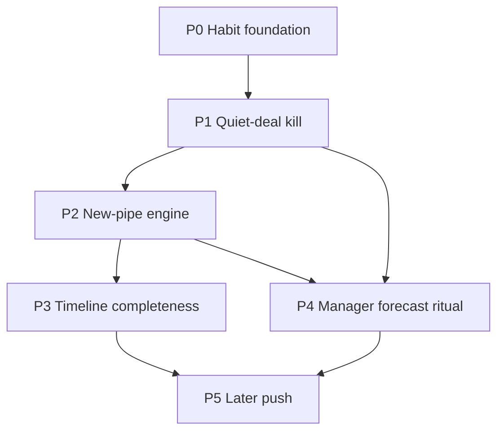

# Sales superpowers roadmap (from your answers)

## What you told us (locked context)

| Signal | Implication |
| --- | --- |
| Pain = **new pipe** + **quiet deals** | Optimize for top-of-funnel intake and silence/next-step hygiene — not more KPIs |
| Reps first; managers for performance + agent reports | Rep home = action queue; managers keep pulse/agent (already strong) |
| Day lives in **Outlook** (+ notes / sometimes Sage) | Superpowers must feel like “open CRM → do these 5 things,” not a second Sage |
| Sage logging is **inconsistent** | Mail + change log are more trustworthy than Sage activity alone; still sync Sage for what *is* logged |
| **In-app until habits stick** | No Slack/email digests in phase 1 |
| Both farming + outbound | Sequences + screening + Sage leads all matter |
| Weekly/monthly **exec forecast** | Protect trusted forecast (certainty × amount × close month); surface risk exceptions for the meeting |
| 12–15 reps, 2 managers; pushing better opp logging | Soft enforcement (required next step, visible “no action”) beats hard gates at first |

## Already built (do not rebuild)

- Pipeline pulse + `read_pipeline_report` (manager / exec questions)
- Sequences, Screening (per-rep), Follow-ups from mail, Microsoft sync
- Sage company/person/opportunity + map
- Draft path for Sage extras: [`.cursor/plans/sage_extra_modules_plan_7eefa258.plan.md`](.cursor/plans/sage_extra_modules_plan_7eefa258.plan.md) → `docs/plans/sage-extra-modules.md` (not authored yet)

## Recommended order (why this order)

### P0 — Habit foundation (1–2 weeks of product focus)

**Goal:** Make “open this app” equal “here is my work today.”

- **Rep Action Queue** on overview (Me): one list combining
  - stuck deals (existing pulse rule, 14d+)
  - open deals with **no dated next task**
  - accepted follow-ups due / overdue
  - sequence enrollments awaiting reply / stalled steps
- Keep Me / Everyone; Me is the rep home. Managers stay on Everyone + agent.
- Soft copy only (“Add next step”) — no stage-lock yet.

**Why first:** Outlook is home; without a single in-app worklist, every later feature stays optional.

### P1 — Quiet-deal kill (core “superpower”)

**Goal:** Silence becomes visible and actionable before the weekly forecast.

- **Quiet deal definition (mechanical):** open deal AND (no tracked `DealFieldChange` in N days OR no inbound/outbound `EmailMessage` / `Activity` tied to company/contact in N days). Start N = 14 to match stuck; tune with managers.
- Surface on Action Queue + optional column on deals list (“Last touch”).
- Deal sheet: **Next step** block (date + note → `Activity` TASK). Stage move **warns** if missing next step (enforce later if culture holds).
- Agent tool (later thin): `list_quiet_deals` or extend pulse — still observed data only.

**Why this beats Sage notes sync for quiet deals:** humans skip logging; mailbox sync already runs. Silence in Outlook is the ground truth.

### P2 — New-pipe engine

**Goal:** More qualified opportunities enter the system without more admin.

1. **Finish Screening habits** — apply pending per-rep migration if not done; make Screening a weekly rep ritual (“clear unmatched”).
2. **Sequences → pipeline glue** (from sequences backlog):
   - Deal-stage or “no open deal” enroll triggers
   - Reply auto-stop is done; add “stalled enrollment” on Action Queue
   - Optional: agent-assisted step copy from last real thread (draft only)
3. **Sage leads → Contact** (product decision already in extra-modules plan: `sageIsLead`, no Lead table) — top-of-funnel that already exists in Sage becomes visible here; create-as-lead toggle when reps start new pipe in-app.
4. **Company map + Screening** — farm/account hunting for unlinked or cold regions (lighter; after 1–3).

**Why:** Your #1 pain is not enough new pipe; leads + sequences + screening are the three intake valves you already partly own.

### P3 — Timeline completeness (Sage communications + notes)

**Goal:** When someone *did* log in Sage, it shows here; reduce “check Sage” for history.

- Execute [sage extra modules](.cursor/plans/sage_extra_modules_plan_7eefa258.plan.md): `communication` + `notes` → `Activity` (pull-first).
- Do **not** treat this as the quiet-deal oracle (logging is spotty). Use it for prep and coaching context.
- Dedup with Outlook email activities stays backlog (v1 = separate rows).

### P4 — Manager / exec forecast ritual

**Goal:** Weekly/monthly meetings run on exceptions, not slide archaeology.

- Everyone pulse already covers movers / stuck / certainty.
- Add **Forecast risk pack** (in-app, pre-meeting): quiet deals in this month’s close bucket, certainty drops in range, close-date slips (from change log), deals with no next step closing this month.
- Pipeline agent prompts/shortcuts: “What’s at risk this month?” wired to report + quiet rules (no invented risk scores).
- Per-rep coaching strip for 2 managers (activity density optional later; start with owned quiet + stuck + won/lost in range).

### P5 — Later (after habits stick)

- Email/Teams digests (you deferred)
- Hard “cannot move stage without next step”
- Win/loss reason tags → learning loop
- Meeting-prep agent brief on calendar open
- Bounce/NDR sequence stops, send caps
- Bidirectional Sage notes/comms edit

## What not to prioritize soon

- Second forecasting model that fights Sage certainty%
- Generic AI without tools
- Heavy quotes/orders until SOAP works
- Push notifications before Action Queue adoption

## Suggested first build slice (when you say go)

1. Author `docs/plans/sales-superpowers.md` (this roadmap as living plan) **or** jump straight to an implementation plan for **Action Queue + quiet deals + next-step on deal**.
2. In parallel track: finish writing `docs/plans/sage-extra-modules.md` (leads = new pipe; comms = timeline) so Sage work has a home.
3. Confirm with managers: quiet window (14d vs 7d) and whether “no next step” is warning-only for 30 days.

## Success metrics (simple)

- % open deals with a dated next step (target climb over 4–6 weeks)
- Count of quiet deals week-over-week (should fall)
- Screening clears + sequence enrollments per rep (new pipe volume)
- Forecast meeting: fewer “I don’t know” on at-risk names (qualitative with managers)
