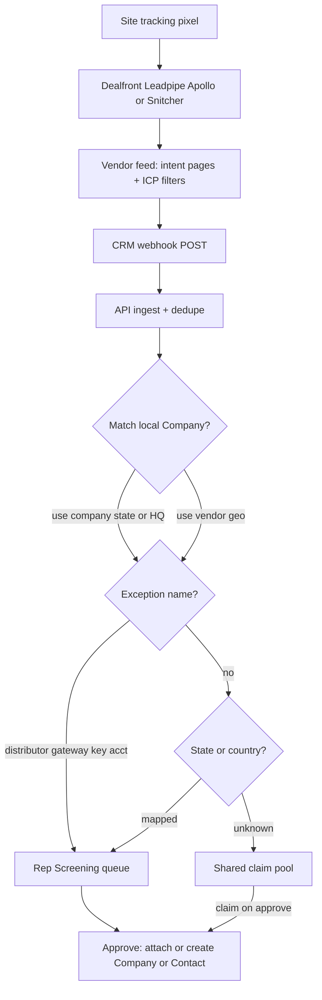

# Website visitors → Screening (company + intent)

## Verdict on the Reddit feedback

That take is right for **technical B2B**, and it applies to Mobile Mark antennas as much as FinOps:

- **RB2B / person-IP as primary is a bad fit.** It floods Screening with lunch-break browsers and random employees. Match rates are low; noise is high.
- **Useful signal = company + behavior.** “Caterpillar’s office hit the product/datasheet pages three times this week” is actionable. “Someone named Pat visited the homepage” is not.
- **6sense / Demandbase** are real account-intent platforms, but enterprise-priced and ABM-heavy. Defer until company-visitor intake proves value.
- **Gated technical content** (datasheets, RFQ, configurator) remains the highest-quality self-ID path. Treat visitor ID as a **complement**, not a replacement.

**Default decisions (from this feedback + MM context):**

1. **Identity level:** company-first. No person-level vendor as the Screening feed.
2. **Routing:** territory when resolvable; shared claim pool only for unmatched.
3. **Vendor shortlist to trial:** Dealfront (company); Leadpipe (person+ICP, US); **Apollo** if the team already wants Apollo for outbound/enrichment (company free, contact needs Inbound add-on). Snitcher as cheap company backup. Skip RB2B, Clearbit/HubSpot-only, and ZoomInfo/6sense for v1.

## What Screening is today (constraint)

Screening is **per-rep Outlook harvest**, not a shared claim pool:

- Model: [`PendingContact`](packages/db/prisma/schema.prisma) — requires `email` + `userId` (mailbox owner); unique `(userId, email)`.
- Entry: Outlook mail sync only ([`screening-harvest.service.ts`](apps/api/src/screening/screening-harvest.service.ts)).
- Approve → Contact via company match ([`createFromScreening`](apps/api/src/contacts/contacts.service.ts)).

Visitor companies **do not fit `PendingContact` cleanly** (no email; company-centric; may be shared). Do **not** overload that model.

## Recommended product shape

### Vendor trial criteria (before any CRM code)

Run a **2–4 week pixel trial** on mobilemark.com (and any product microsites) with **no CRM sync yet**. Score:

- % of sessions resolved to a named company
- % that match existing Sage companies (domain / name)
- Noise: ISPs, competitors, job seekers, student traffic
- Whether **page filters** (product, datasheet, RFQ, configurator — not homepage alone) cut noise enough for reps

**Dealfront (Leadfeeder):** company-level. Custom feeds filter `page_url`, visits, region; webhooks / workflows POST company JSON. GDPR-clean company-only posture. Best default if Screening should stay “account visited product pages.”

**Leadpipe:** person-level on **US** traffic (name, work email, LinkedIn, title, phone + pages); **EU/UK auto-geofenced to company-only**. Claims ICP filtering/scoring, real-time webhooks (First Match / Every Update), state/country in payload (useful for territory), free trial (~500 IDs). Closer to RB2B’s category but stronger CRM/webhook/ICP story — still subject to the Reddit noise risk unless title + page filters are strict before Screening ingest. Good A/B trial against Dealfront if reps want named contacts when available.

**[Apollo Website Visitor Identification](https://www.apollo.io/product/website-visitor-identification):** company + optional contact. Company ID is on the **free plan** (firmographics + pages); **contact-level needs the Inbound add-on** and is **US-only**. Strong ICP filters (title, size, tech stack, geography) and intent/page scoring — good answer to the Reddit “lunch break noise” problem. Built-in Slack alerts, inbound router, and sequences keep action inside Apollo. For MM-CRM, expect Zapier/workflow → custom webhook or API polling rather than a visitor-native push like Leadpipe; emails/phones burn Apollo credits. Best pick **if** sales already wants Apollo for outbound/enrichment; weaker as a visitor-ID-only buy into a custom Nest CRM.

**Snitcher:** cheaper company IP ID; evaluate if Dealfront is overkill after the trial.

**Explicit non-goals for v1:** RB2B as Screening feed; 6sense/Demandbase; HubSpot Breeze.

#### Quick compare

- **Dealfront** — company only; intent feeds; mid-market; clean compliance; custom webhook-friendly
- **Leadpipe** — person (US) + company (EU); ICP filters; first-class webhooks; trial easy
- **Apollo** — company free / contact via Inbound; deep ICP + intent; sequences built-in; best if Apollo is already the GTM stack; custom CRM pipe is secondary
- **Snitcher** — company; cheaper; thinner enrichment
- **RB2B** — person US; noisy for technical B2B; weak CRM story → skip
- **6sense / Demandbase** — account intent across the web; enterprise → later

### Intent filters (the Reddit lesson)

Only enqueue companies that meet **at least one** high-intent rule, configured in the vendor feed (and optionally re-checked on ingest):

- Visited product / antenna / datasheet / application / RFQ / contact pages (exact path list from the live site)
- Multiple pageviews or return visits within N days
- Exclude known junk: consumer ISPs if tagged, careers pages only, blocked competitor domains

Homepage-only visits stay in the vendor UI for marketing, **not** in Screening.

### CRM data model (after trial)

New intake, sibling to mail Screening — same UI surface, different source:

- New model e.g. `PendingVisitor` (or generalize Screening to a polymorphic intake). Fields: vendor id, company name, domain, country/region/state, pages[], visitCount, first/lastSeen, optional person fields if vendor supplies them (email, name, LinkedIn, title), `assignedUserId` nullable (null = shared pool), `claimedById`, status, matched `companyId` if any, source `WEBSITE`.
- Territory config checked into repo (today it exists only as chat paste): e.g. [`data/sales-territory.json`](data/sales-territory.json) from your map + a small `assignRep(companyName, state, country)` helper implementing Nicole’s cascade: **exception → geo → unmatched**.
- Map `rep_code` / email → local `User` (same emails already in Sage user list). Resolve Ken / Demo Sales Sage-27 collision before using Sage IDs for routing.

### Routing rules

| Case | Queue |
|------|--------|
| Exception (gateway MFR, distributor, IL key account) | Fixed rep(s); MCA stays shared or manual until policy |
| Matched company with `stateCode` / country | Territory geo |
| Unmatched company with vendor state/region | Territory geo |
| No usable geo | Shared pool (`assignedUserId` null) |
| Approve / claim | Set `claimedById`; hide from other reps’ shared view; create/attach Company (and optional Contact if vendor later supplies one) |

Do **not** fan out the same visitor to every rep’s queue when geo is known — that creates duplicate work. Shared pool is only for unmatched.

### Screening UI

Extend [`/screening`](apps/app/app/(app)/screening/) (tabs or source column):

- **Mail** — existing `PendingContact`
- **Web** — visitor companies: name, domain, pages, visits, suggested rep / “Unassigned”

Approve reuses [`companies.similar`](apps/api/src/companies/company-similar.ts) + company create path; owner = claiming / territory rep (not stale Sage acctmgr for this intake — ops rule prefers territory).

### Complementary track (no vendor required)

Document as Phase B, not blocking:

- Gate high-value assets (datasheets, RFQ) behind work email → harvest into Screening / Contacts with proven intent
- Use LinkedIn Sales Navigator for named outreach on accounts that already showed **web intent** (visitor feed as account list, not person ID)

## Phased delivery

1. **Decide + trial** — pick Dealfront or Snitcher; install pixel; define intent page list; measure 2–4 weeks; no CRM writes yet.
2. **Territory module** — commit territory JSON; `assignRep` + User email map; unit tests for cascade/exceptions.
3. **Ingest API** — signed webhook; dedupe by vendor company id / domain; apply filters + territory; write `PendingVisitor`.
4. **Screening UI** — Web tab + claim/approve; badge counts include web PENDING for assigned + claimed-by-me shared items.
5. **Ops** — suppress existing customers optionally; Slack/rail badge; refine page filters from real noise.

## Risks / honesty

- Reverse-IP often misses remote/mobile; office OEM traffic will ID better than home Wi‑Fi.
- Visitor “state” is not BILL-TO; it is a proxy until the company is matched to a Sage record with address.
- Person-level enrichment (LinkedIn of a buyer) stays a **human** step after company approve, or a later add-on — not the ingest pipe.
