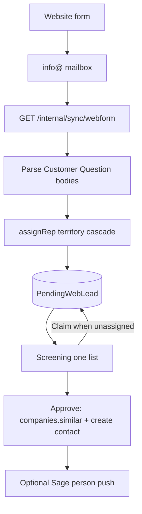

# Website form leads → Screening

**Status (DONE prod wiring 2026-08-05):** code on `main`; Entra application
`Mail.Read` + Exchange policy group `CRM-Webform-Mailbox-Access` →
`info@mobilemark.com`; Railway api `WEBFORM_MAILBOX`; `cron-webform` every
5 minutes → `/internal/sync/webform`. Wait up to ~1h for policy grant, then
smoke Screening for Web rows.

Canonical plan for ingesting Mobile Mark website "Customer Question" emails
into the Screening queue, routed by the sales territory map.

## Decisions

- **Ingest:** Watch the shared mailbox (`WEBFORM_MAILBOX`, e.g.
  `info@mobilemark.com`) with Microsoft Graph app-only credentials. Match
  subjects that contain `Customer Question` (covers `FW:` forwards).
- **Routing:** Hybrid — `assignRep` from [`data/sales-territory.json`](../../data/sales-territory.json)
  when resolvable; otherwise a **shared pool** (`assignedUserId` null). First
  claimer owns it; approve sets that person as contact owner.
- **Surface:** One Screening list (Mail + Web rows with a source badge). No
  second tab. Rail count includes web leads assigned to you + unassigned.
- **Territory:** Ops rule — exception → bill-to geo → unmatched. Not Sage
  `acctmgr`. Skip `KEN` until email is set. MCA → shared pool.

## Architecture



## Files

| Piece | Path |
| --- | --- |
| Territory JSON | `data/sales-territory.json` |
| `assignRep` / `inferGeoFromForm` | `packages/db/src/sales-territory.ts` |
| Model | `PendingWebLead`, `WebformMailboxSync` in Prisma |
| Parser | `apps/api/src/screening/webform-parse.ts` |
| Ingest | `apps/api/src/screening/webform-ingest.service.ts` |
| Cron | `GET/POST /internal/sync/webform` (`CRON_SECRET`) |
| App token | `apps/api/src/microsoft/microsoft-app-token.service.ts` |
| UI | `apps/app/app/(app)/screening/screening-table.tsx` |

## Ops: turn ingest on (explicit)

You already have an Entra app for CRM sign-in (`MICROSOFT_CLIENT_ID` /
`SECRET` / `TENANT_ID`). Webform ingest reuses that same app, but needs an
**application** (daemon) permission — different from the **delegated**
`Mail.Read` reps grant when they connect Outlook.

### Why two kinds of permission

| Kind | Who signs in | What we use it for |
| --- | --- | --- |
| Delegated `Mail.Read` | Each sales rep | Sync *their* mailbox into the CRM |
| Application `Mail.Read` | No user — the app itself | Read `info@` on a schedule |

Without the application permission, the cron cannot open `info@`.

### Step A — Add application Mail.Read (Azure portal)

1. Open [Microsoft Entra admin center](https://entra.microsoft.com) →
   **Identity** → **Applications** → **App registrations**.
2. Open the same app the CRM already uses (the one whose Client ID is in
   Railway `MICROSOFT_CLIENT_ID`).
3. Left nav: **API permissions** → **Add a permission** → **Microsoft Graph**
   → **Application permissions** (not Delegated).
4. Search `Mail.Read` → check **Mail.Read** → **Add permissions**.
5. Click **Grant admin consent for your tenant** and confirm. Status
   must show a green check for `Mail.Read` (Application).

`Mail.Read` application can read **every** mailbox in the tenant unless you
add Step B. Do Step B before you rely on this in production.

### Step B — Limit the app to info@ only (Exchange Online)

Run this in **Exchange Online PowerShell** as a Global Admin or Exchange
Admin (install module once: `Install-Module -Name ExchangeOnlineManagement`).

```powershell
Connect-ExchangeOnline

# 1) Mail-enabled security group that contains ONLY the shared mailbox
New-DistributionGroup -Name "CRM-Webform-Mailbox-Access" -Type Security -Members "info@mobilemark.com"

# 2) Policy: this Entra app may only use application mail access on that group
#    Replace <MICROSOFT_CLIENT_ID> with the same GUID as Railway MICROSOFT_CLIENT_ID
New-ApplicationAccessPolicy `
  -AppId "<MICROSOFT_CLIENT_ID>" `
  -PolicyScopeGroupId "CRM-Webform-Mailbox-Access" `
  -AccessRight RestrictAccess `
  -Description "CRM webform ingest may only read info@"

# 3) Sanity check (may take 30–60 minutes to fully apply)
Test-ApplicationAccessPolicy -Identity "info@mobilemark.com" -AppId "<MICROSOFT_CLIENT_ID>"
# Expect: AccessCheckResult = Granted

Test-ApplicationAccessPolicy -Identity "swenzelman@mobilemark.com" -AppId "<MICROSOFT_CLIENT_ID>"
# Expect: AccessCheckResult = Denied
```

If `info@` is a shared mailbox, make sure it exists in Exchange and that the
security group membership includes it (use the mailbox’s primary SMTP).

### Step C — Railway / env

On the **api** service:

```text
WEBFORM_MAILBOX=info@mobilemark.com
```

Keep existing `MICROSOFT_CLIENT_ID`, `MICROSOFT_CLIENT_SECRET`,
`MICROSOFT_TENANT_ID`, and `CRON_SECRET`. No new Azure client is required.

Unset `WEBFORM_MAILBOX` → ingest stays off (safe default).

### Step D — Cron the poller

Railway service **`cron-webform`** (created 2026-08-05): curl image,
schedule `*/5 * * * *`, same vars pattern as `cron-microsoft`
(`API_PUBLIC_URL`, `CRON_SECRET`):

```bash
curl -sS -H "Authorization: Bearer $CRON_SECRET" \
  "https://api.mobilemarksalestool.com/internal/sync/webform"
```

First successful run creates a `webformMailboxSync` row and only walks recent
inbox mail. Later runs only process messages newer than the cursor.

### Step E — Reps in the CRM

Territory emails (e.g. `swenzelman@mobilemark.com`) must already be `User`
rows (they signed in once). Otherwise the lead still appears, but in the
**Unassigned** shared pool for anyone to Claim.

### Smoke test

1. Deploy api (migration `20260805140000_add_pending_web_lead`).
2. Set `WEBFORM_MAILBOX` after Steps A–B.
3. Hit `/internal/sync/webform` once with `CRON_SECRET`.
4. Response should show `"skipped": false` and ideally `"created": N`.
5. Open **Screening** — Web rows with Claim / Approve.

If you get Graph `403` / `AccessDenied` on the mailbox, Step B has not
propagated yet, or the group does not include `info@`.

## Approve path

Same as mail Screening: `companies.similar` dialog →
`createFromScreening` (phone passed for web) → optional Sage person push when
the company has `sageCrmCompanyId`.

## Related

- Anonymous visitor ID (Dealfront etc.) stays on
  [`.cursor/plans/website_visitor_screening_e42571d1.plan.md`](../../.cursor/plans/website_visitor_screening_e42571d1.plan.md)
  and should reuse `data/sales-territory.json` + `assignRep`.
